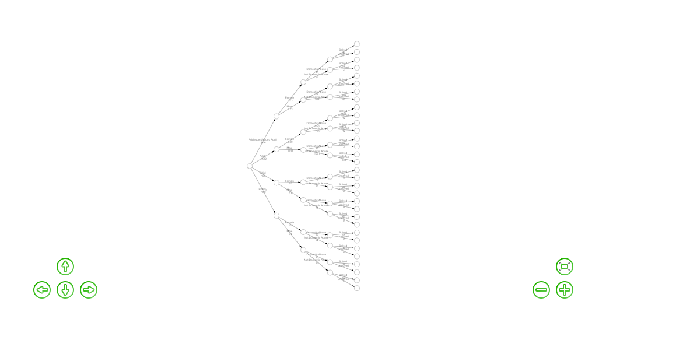
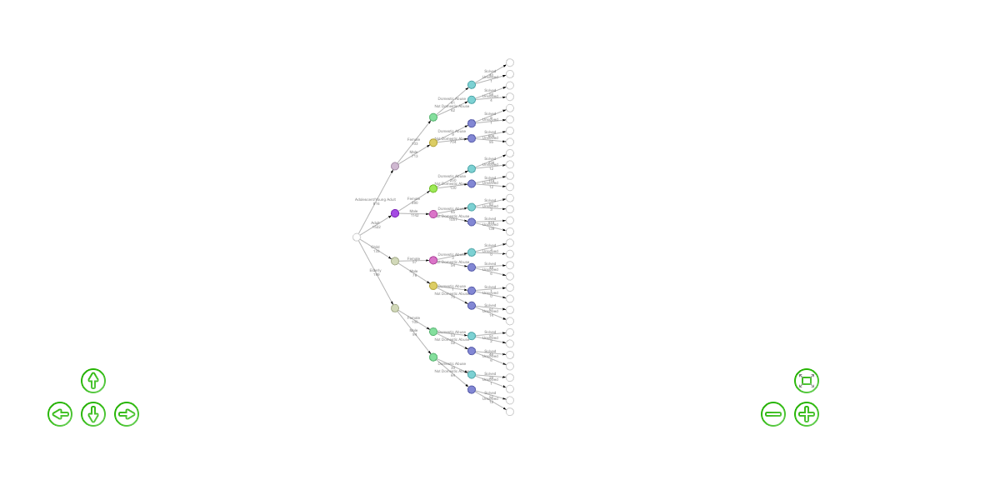
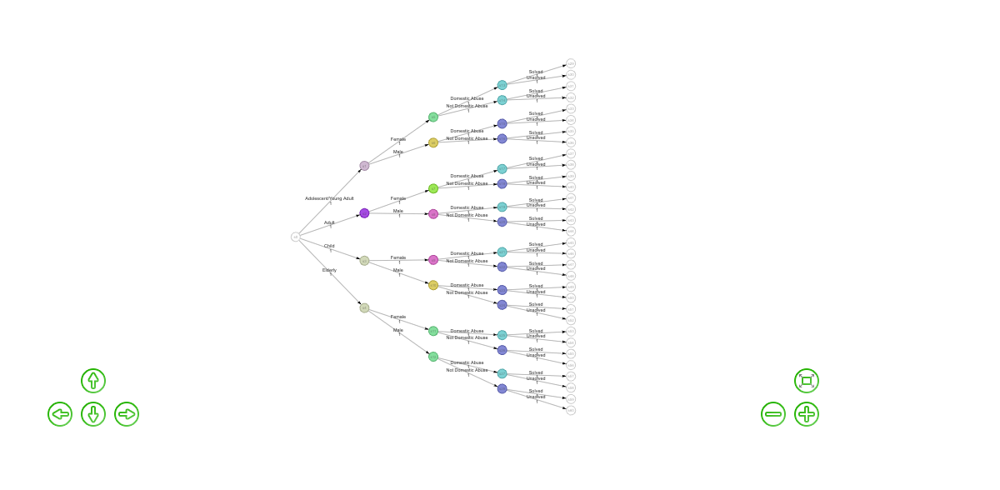
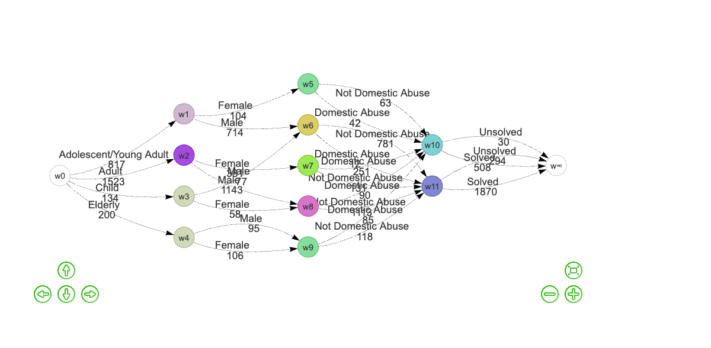

stCEG README
================

<!-- README.md is generated from README.Rmd. Please edit that file -->

# stCEG

<!-- badges: start -->
<!-- badges: end -->

The goal of `stCEG` is to facilitate the creation of Chain Event Graphs
over spatial areas. It allows users to fully customise both the
structure and underlying model of the Chain Event Graph, offering a high
degree of flexibility for tailored analyses.

## Installation

You can install the stable version of `stCEG` from CRAN with:

``` r
install.packages("stCEG")
```

Or the development version from [GitHub](https://github.com/) with:

``` r
remotes::install_github("holliecalley/stCEG")
```

    ## Using github PAT from envvar GITHUB_PAT. Use `gitcreds::gitcreds_set()` and unset GITHUB_PAT in .Renviron (or elsewhere) if you want to use the more secure git credential store instead.

    ## Skipping install of 'stCEG' from a github remote, the SHA1 (f79d14af) has not changed since last install.
    ##   Use `force = TRUE` to force installation

## Usage

With the `stCEG` package, it is simple for a user to create an event
tree from a given dataset, colour it to turn it into a staged tree,
specify priors over this, and then convert this into a Chain Event Graph
(CEG). The package also allows for model comparison and the creation of
maps based on spatial CEGs, as well as a `Shiny` user-interface.

``` r
library(stCEG)
data <- homicides
event_tree <- create_event_tree(data, columns = c(1,2,4,5), "both")
event_tree$eventtree
```

    ## file:////private/var/folders/8q/_ftph8z911d1mg099mv8rt6h0000gn/T/RtmpJkb7Tq/filef92d77fde3b2/widgetf92d3d6ff8a9.html screenshot completed



``` r
coloured_tree <- ahc_colouring(event_tree)
coloured_tree$stagedtree
```

    ## file:////private/var/folders/8q/_ftph8z911d1mg099mv8rt6h0000gn/T/RtmpJkb7Tq/filef92d1b1c0f8e/widgetf92d4f414189.html screenshot completed



``` r
tree_priors <- specify_priors(coloured_tree, prior_type = "Uniform", ask_edit = FALSE)
```

    ## 
    ## Stage Colour Key:
    ##         #FFFFFF 
    ##         #A54BE3 
    ##         #CFB8D1 
    ##         #D2D9B9 
    ##         #84DF9D 
    ##         #9DE956 
    ##         #DA74C8 
    ##         #DCCD64 
    ##         #7CD1D3 
    ##         #8287D4 
    ## Calculated priors:
    ## # A tibble: 10 × 6
    ##    color   level2 outgoing_edges2 number_nodes prior   stage
    ##    <chr>    <int>           <int>        <dbl> <chr>   <chr>
    ##  1 #FFFFFF      1               4            1 1,1,1,1 u1   
    ##  2 #A54BE3      2               2            1 1,1     u2   
    ##  3 #CFB8D1      2               2            1 1,1     u3   
    ##  4 #D2D9B9      2               2            2 2,2     u4   
    ##  5 #84DF9D      3               2            3 3,3     u5   
    ##  6 #9DE956      3               2            1 1,1     u6   
    ##  7 #DA74C8      3               2            2 2,2     u7   
    ##  8 #DCCD64      3               2            2 2,2     u8   
    ##  9 #7CD1D3      4               2            7 7,7     u9   
    ## 10 #8287D4      4               2            9 9,9     u10  
    ## # A tibble: 10 × 7
    ##    Stage Colour  Level `Outgoing Edges` Nodes Prior   `Prior Mean`       
    ##    <chr> <chr>   <int>            <int> <dbl> <chr>   <chr>              
    ##  1 u1    #FFFFFF     1                4     1 1,1,1,1 0.25,0.25,0.25,0.25
    ##  2 u2    #A54BE3     2                2     1 1,1     0.5,0.5            
    ##  3 u3    #CFB8D1     2                2     1 1,1     0.5,0.5            
    ##  4 u4    #D2D9B9     2                2     2 2,2     0.5,0.5            
    ##  5 u5    #84DF9D     3                2     3 3,3     0.5,0.5            
    ##  6 u6    #9DE956     3                2     1 1,1     0.5,0.5            
    ##  7 u7    #DA74C8     3                2     2 2,2     0.5,0.5            
    ##  8 u8    #DCCD64     3                2     2 2,2     0.5,0.5            
    ##  9 u9    #7CD1D3     4                2     7 7,7     0.5,0.5            
    ## 10 u10   #8287D4     4                2     9 9,9     0.5,0.5

``` r
staged_tree <- staged_tree_prior(coloured_tree, tree_priors)
staged_tree$stagedtree
```

    ## file:////private/var/folders/8q/_ftph8z911d1mg099mv8rt6h0000gn/T/RtmpJkb7Tq/filef92d135a61e4/widgetf92d12d0c9a9.html screenshot completed



``` r
ceg <- create_ceg(staged_tree, view_table = FALSE)
```

    ## # A tibble: 13 × 8
    ##    contract_id                         ids   label level color id    font   size
    ##    <chr>                               <chr> <chr> <int> <chr> <chr> <chr> <dbl>
    ##  1 1-#FFFFFF                           s0    w0        1 #FFF… w0    80px    100
    ##  2 2-#CFB8D1-3-#84DF9D-4-#7CD1D3-5-#F… s1    w1        2 #CFB… w1    80px    100
    ##  3 2-#A54BE3-3-#9DE956-4-#7CD1D3-5-#F… s2    w2        2 #A54… w2    80px    100
    ##  4 2-#D2D9B9-3-#DA74C8-4-#7CD1D3-5-#F… s3    w3        2 #D2D… w3    80px    100
    ##  5 2-#D2D9B9-3-#84DF9D-4-#7CD1D3-5-#F… s4    w4        2 #D2D… w4    80px    100
    ##  6 3-#84DF9D-4-#7CD1D3-5-#FFFFFF-5-#F… s5    w5        3 #84D… w5    80px    100
    ##  7 3-#DCCD64-4-#8287D4-5-#FFFFFF-5-#F… s6, … w6        3 #DCC… w6    80px    100
    ##  8 3-#9DE956-4-#7CD1D3-5-#FFFFFF-5-#F… s7    w7        3 #9DE… w7    80px    100
    ##  9 3-#DA74C8-4-#7CD1D3-5-#FFFFFF-5-#F… s8, … w8        3 #DA7… w8    80px    100
    ## 10 3-#84DF9D-4-#7CD1D3-5-#FFFFFF-5-#F… s11,… w9        3 #84D… w9    80px    100
    ## 11 4-#7CD1D3-5-#FFFFFF-5-#FFFFFF       s13,… w10       4 #7CD… w10   80px    100
    ## 12 4-#8287D4-5-#FFFFFF-5-#FFFFFF       s15,… w11       4 #828… w11   80px    100
    ## 13 5-#FFFFFF                           s29,… w∞        5 #FFF… w∞    80px    100
    ## # A tibble: 26 × 21
    ##    from  to    label1    colour_from sumlabel2 sumlabel3 total label_individuals
    ##    <chr> <chr> <chr>     <chr>           <dbl>     <dbl> <dbl> <chr>            
    ##  1 w0    w1    Adolesce… #FFFFFF           816         1   817 "Adolescent/Youn…
    ##  2 w0    w2    Adult     #FFFFFF          1522         1  1523 "Adult \n 1523"  
    ##  3 w0    w3    Child     #FFFFFF           133         1   134 "Child \n 134"   
    ##  4 w0    w4    Elderly   #FFFFFF           199         1   200 "Elderly \n 200" 
    ##  5 w1    w5    Female    #CFB8D1           103         1   104 "Female \n 104"  
    ##  6 w1    w6    Male      #CFB8D1           713         1   714 "Male \n 714"    
    ##  7 w10   w∞    Solved    #7CD1D3           501         7   508 "Solved \n 508"  
    ##  8 w10   w∞    Unsolved  #7CD1D3            23         7    30 "Unsolved \n 30" 
    ##  9 w11   w∞    Solved    #8287D4          1861         9  1870 "Solved \n 1870" 
    ## 10 w11   w∞    Unsolved  #8287D4           285         9   294 "Unsolved \n 294"
    ## # ℹ 16 more rows
    ## # ℹ 13 more variables: font.size <dbl>, stage_total_posterior <dbl>,
    ## #   posterior_total <dbl>, stage_total_prior <dbl>, prior_total <dbl>,
    ## #   prior_mean <dbl>, posterior_mean <dbl>, label_posterior <chr>,
    ## #   label_prior_mean <chr>, label_prior <chr>, color <chr>, smooth <list>,
    ## #   level <int>
    ## # A tibble: 13 × 9
    ##    contract_id            ids   label level color id    font   size fixed       
    ##    <chr>                  <chr> <chr> <int> <chr> <chr> <chr> <dbl> <list>      
    ##  1 1-#FFFFFF              s0    w0        1 #FFF… w0    80px    100 <named list>
    ##  2 2-#CFB8D1-3-#84DF9D-4… s1    w1        2 #CFB… w1    80px    100 <named list>
    ##  3 2-#A54BE3-3-#9DE956-4… s2    w2        2 #A54… w2    80px    100 <named list>
    ##  4 2-#D2D9B9-3-#DA74C8-4… s3    w3        2 #D2D… w3    80px    100 <named list>
    ##  5 2-#D2D9B9-3-#84DF9D-4… s4    w4        2 #D2D… w4    80px    100 <named list>
    ##  6 3-#84DF9D-4-#7CD1D3-5… s5    w5        3 #84D… w5    80px    100 <named list>
    ##  7 3-#DCCD64-4-#8287D4-5… s6, … w6        3 #DCC… w6    80px    100 <named list>
    ##  8 3-#9DE956-4-#7CD1D3-5… s7    w7        3 #9DE… w7    80px    100 <named list>
    ##  9 3-#DA74C8-4-#7CD1D3-5… s8, … w8        3 #DA7… w8    80px    100 <named list>
    ## 10 3-#84DF9D-4-#7CD1D3-5… s11,… w9        3 #84D… w9    80px    100 <named list>
    ## 11 4-#7CD1D3-5-#FFFFFF-5… s13,… w10       4 #7CD… w10   80px    100 <named list>
    ## 12 4-#8287D4-5-#FFFFFF-5… s15,… w11       4 #828… w11   80px    100 <named list>
    ## 13 5-#FFFFFF              s29,… w∞        5 #FFF… w∞    80px    100 <named list>
    ## # A tibble: 26 × 22
    ##    from  to    label1    colour_from sumlabel2 sumlabel3 total label_individuals
    ##    <chr> <chr> <chr>     <chr>           <dbl>     <dbl> <dbl> <chr>            
    ##  1 w0    w1    Adolesce… #FFFFFF           816         1   817 "Adolescent/Youn…
    ##  2 w0    w2    Adult     #FFFFFF          1522         1  1523 "Adult \n 1523"  
    ##  3 w0    w3    Child     #FFFFFF           133         1   134 "Child \n 134"   
    ##  4 w0    w4    Elderly   #FFFFFF           199         1   200 "Elderly \n 200" 
    ##  5 w1    w5    Female    #CFB8D1           103         1   104 "Female \n 104"  
    ##  6 w1    w6    Male      #CFB8D1           713         1   714 "Male \n 714"    
    ##  7 w10   w∞    Solved    #7CD1D3           501         7   508 "Solved \n 508"  
    ##  8 w10   w∞    Unsolved  #7CD1D3            23         7    30 "Unsolved \n 30" 
    ##  9 w11   w∞    Solved    #8287D4          1861         9  1870 "Solved \n 1870" 
    ## 10 w11   w∞    Unsolved  #8287D4           285         9   294 "Unsolved \n 294"
    ## # ℹ 16 more rows
    ## # ℹ 14 more variables: font.size <dbl>, stage_total_posterior <dbl>,
    ## #   posterior_total <dbl>, stage_total_prior <dbl>, prior_total <dbl>,
    ## #   prior_mean <dbl>, posterior_mean <dbl>, label_posterior <chr>,
    ## #   label_prior_mean <chr>, label_prior <chr>, color <chr>, smooth <list>,
    ## #   level <int>, label <chr>

``` r
ceg$ceg
```

    ## file:////private/var/folders/8q/_ftph8z911d1mg099mv8rt6h0000gn/T/RtmpJkb7Tq/filef92d558d70da/widgetf92d38ec2417.html screenshot completed


